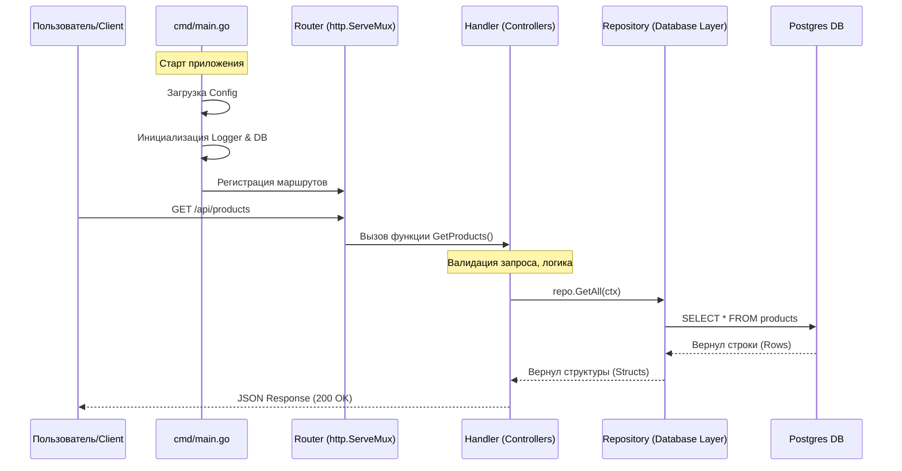

# Путеводитель по твоему проекту (Warehouse Management System)

С возвращением! Амнезия — дело серьезное, но код все помнит. Этот гайд написан специально для тебя, чтобы ты за 15 минут чтения полностью восстановил картину происходящего в этом проекте (и даже лучше понял Go).

Здесь мы пойдем от общего к частному: сначала посмотрим на систему "с высоты птичьего полета", а потом залезем под капот в каждую важную папку.

---

## 🦅 Архитектура: Вид сверху (Big Picture)

Твой проект — это **Backend API** для системы управления складом. Он написан на **Go** и следует принципам **Clean Architecture** (чистой архитектуры), но в упрощенном и прагматичном виде.

### Как бегут данные? (Request Flow)

Когда фронтенд или Postman отправляет запрос (например, "Создай товар"), происходит следующее:



**Ключевая идея:**
1.  **Handler (Обработчик)**: Знает про HTTP (заголовки, JSON), но НЕ знает про SQL. Он принимает заказ, проверяет его и передает "на кухню".
2.  **Repository (Репозиторий)**: Знает про SQL (INSERT, SELECT), но НЕ знает про HTTP. Это "повар", который работает с базой.
3.  **App (Связной)**: Соединяет их вместе при старте.

---

## 🗺 Карта сокровищ (Структура папок)

Давай пройдемся по папкам, как будто мы открываем шкафы в Ikea.

| Папка | За что отвечает | Аналогия из жизни |
| :--- | :--- | :--- |
| **`cmd/app`** | Точка входа. Здесь лежит `main.go`. | Ключ зажигания автомобиля. |
| **`internal`** | Внутренности, скрытые от других проектов. | Двигатель под капотом. |
| **`internal/config`** | Настройки (порты, пароли к БД). | Приборная панель. |
| **`internal/domain`** | Основные сущности (структуры Go). | Чертежи деталей (Товар, Склад). |
| **`internal/handler`** | Обработчики HTTP запросов (контроллеры). | Официанты, принимающие заказы. |
| **`internal/repository`** | Работа с базой данных (SQL запросы). | Кладовщики, выдающие данные. |
| **`internal/app`** | Сборка приложения (`app.go`). | Сборочный цех, где детали соединяются. |
| **`pkg/logger`** | Утилиты (в данном случае Логгер). | Инструменты (отвёртка, молоток). |
| **`migrations`** | SQL файлы для создания таблиц. | История перепланировки здания. |
| **`docs`** | Документация (Swagger). | Инструкция к применению. |

---

## 🔍 Детальный разбор (Под капот)

### 1. Как все начинается (`cmd/app/main.go`)
Это файл, который запускает всё.
- **Config**: Сначала грузим настройки (`config.NewConfig()`).
- **Logger**: Включаем "черный ящик" для логов (`logger.NewLogger()`).
- **App**: Собираем приложение (`app.NewApp(...)`). Это самый важный момент — здесь мы внедряем зависимости.
- **Server**: Запускаем HTTP сервер (`http.Server`).
- **Graceful Shutdown**: Слушаем сигналы ОС (Ctrl+C), чтобы выключиться мягко, не обрывая активные соединения.

### 2. Сборка (`internal/app/app.go`)
Здесь происходит магия **Dependency Injection** (Внедрение зависимостей).
Вместо того чтобы создавать базу данных *внутри* хендлера, мы создаем её *один раз* здесь и передаем (инжектим) внутрь.

```go
// Примерно так это выглядит упрощенно:
db := ConnectToDB()           // 1. Создали базу
repo := NewProductRepo(db)    // 2. Дали базу репозиторию
handler := NewHandler(repo)   // 3. Дали репозиторий хендлеру
```
Это делает код тестируемым и гибким.

### 3. Настройки (`internal/config`)
Твой конфиг умный. Он ищет настройки в таком порядке приоритета:
1. **Переменные окружения** (ENV, самые главные). `HTTP_PORT=:9090 ./app`
2. **Файл .env** (для удобства локально).
3. **Значения по умолчанию** (если ничего не нашли).

> **Нюанс Go**: `godotenv.Load()` просто читает файлик `.env` и выставляет системные переменные, чтобы `os.Getenv` мог их найти.

### 4. HTTP Хендлеры (`internal/handler`)
Здесь живет `h.GetProducts`, `h.CreateWarehouse` и т.д.
**Маршрутизация**: Ты используешь стандартный роутер Go 1.22 (`http.ServeMux`), который теперь умеет читать методы (`GET /api/products`).

**Типичный сценарий хендлера:**
1.  **Parse**: Читаем данные. Если это URL параметры — `r.PathValue("id")`. Если JSON — `json.NewDecoder(r.Body).Decode(&dto)`.
2.  **Call**: Звоним в репозиторий: `h.productRepo.Create(ctx, product)`.
3.  **Handle Error**: `if err != nil` — логируем и отдаем 500/400 ошибку.
4.  **Respond**: Пишем ответ `writeJSON(w, 200, output)`.

### 5. Репозитории (`internal/repository`)
Здесь чистый SQL. Ты используешь драйвер `pgx` (это крутой и быстрый драйвер для Postgres).
Запросы написаны прямо в коде в виде строк (Raw SQL). Это дает полный контроль.

**Пример:**
```go
query := `INSERT INTO products ... RETURNING id`
r.pool.QueryRow(ctx, query, ...).Scan(&id)
```

---

## ⚡️ Go Syntax Flashbacks (Напоминалка синтаксиса)

Тут вещи, которые ты мог забыть:

### 1. `ctx context.Context`
Паттерн: *Всегда первым аргументом*.
Контекст — это "душа" запроса. Если пользователь закрыл вкладку браузера, контекст отменяется, и мы можем отменить долгий запрос в базу, чтобы не грузить сервер зря.
```go
ctx := r.Context() // Берем из запроса
repo.GetAll(ctx)   // Передаем дальше
```

### 2. `if err != nil`
В Go нет исключений (exceptions). Любая функция, которая может сломаться, возвращает ошибку последним значением.
**Правило:** *Всегда проверяй ошибку сразу*.
```go
result, err := DoSomething()
if err != nil {
    // Обработай: залогируй или верни наверх
    return nil, err
}
// Если дошли сюда, значит все ок
```

### 3. Struct Tags (`json:"name"`)
Это метаданные. Когда ты делаешь `json.Decode`, Go смотрит на эти теги, чтобы понять, какое поле JSON соответствует полю структуры.
```go
type Product struct {
    Name string `json:"name"` // В JSON будет поле "name", а не "Name"
}
```

### 4. Pointers vs Values (`*App` vs `App`)
- Если видишь `*Handler` (звездочку) — это **указатель**. Мы передаем *ссылку* на объект. Если изменить его поля, они изменятся везде. Обычно сервисы и репозитории передают как указатели, чтобы не копировать их и иметь одно состояние (например, одно подключение к БД).
- Без звездочки — **копия**.

### 5. Defer (`defer rows.Close()`)
"Сделай это, когда функция закончится, как бы она ни закончилась (даже с ошибкой)".
Идеально для закрытия файлов, соединений и освобождения памяти.

---

## 🚀 Как запустить эту "махину"?

У тебя есть `docker-compose.yml`, так что все просто.

**Вариант А: Ленивый (все в докере)**
```bash
docker-compose up --build
```
Поднимет:
1.  **Postgres** (база данных)
2.  **Migrate** (накатит таблицы)
3.  **App** (твое приложение на порту 8080)
4.  **PgAdmin** (админка для базы на порту 8588)

**Вариант Б: Разработчик (кодим локально, база в докере)**
1.  Запусти только базу: `docker-compose up postgres migrate`
2.  Запусти приложение: `go run cmd/app/main.go`

## 📚 Swagger (Документация API)

В коде ты видишь странные комментарии типа `// @Summary`. Это аннотации для **Swag**.
Если ты поменял код, обнови доки командой:
```bash
swag init -g cmd/app/main.go
```
(Результат упадет в папку `docs/swagger`).

Посмотреть красивую доку можно по адресу: `http://localhost:8080/swagger/index.html` (когда сервер запущен).

---

Вроде все! Теперь ты знаешь, где "двигатель", где "руль", и почему "бензин" (данные) течет именно так. Удачного кодинга! 🚀
